# Home Hub 🏠

A real-time IoT dashboard for Raspberry Pi 5, displaying sensor data, weather, public transport, and system metrics on a kiosk display.

```
┌─────────────────────────────────────────────────────────────────┐
│  🗺️ Traffic    │  🗺️ Traffic    │  📅 Calendar   │  📅 Calendar  │
│     Map 1      │     Map 2      │      #1        │      #2       │
├────────────────┴────────────────┴────────────────┴──────────────┤
│  ⏰ Clock      │        🌤️ Weather & 🌡️ Sensors       │  🚌 Bus    │
│  💻 System     │                                       │ Departures │
└─────────────────────────────────────────────────────────────────┘
```

## Features

- **IoT Sensors** - Real-time temperature, humidity, pressure from Raspberry Pi Pico 2W devices
- **Weather** - Current conditions & 7-day forecast via Open-Meteo API
- **Transport** - Live Prague bus departures via Golemio API
- **System Monitor** - CPU, RAM, Disk, Temperature metrics
- **Kiosk Modes** - Automatic day/night display switching
- **Real-time Updates** - WebSocket-based instant UI updates

## Tech Stack

| Layer          | Technology                                         |
|----------------|----------------------------------------------------|
| Backend        | Python 3.14, FastAPI, Paho-MQTT, SQLite            |
| Frontend       | HTML5, CSS3, Vanilla JavaScript, Lucide Icons      |
| IoT            | Raspberry Pi Pico 2W, MicroPython, DS18B20, BME280 |
| Infrastructure | Raspberry Pi 5, Mosquitto MQTT                     |

## Quick Start

```bash
# Setup
./setup.sh

# Configure
cp .env.example .env
# Edit .env with your settings

# Run
python main.py
```

Access at `http://localhost:8000`

## Architecture

```mermaid
flowchart LR
    SENSORS["🌡️ IoT Sensors"] -->|MQTT| BROKER["📡 Mosquitto"]
    BROKER --> SERVER["🖥️ FastAPI"]
    SERVER -->|WebSocket| DASHBOARD["📺 Dashboard"]
    APIS["🌐 External APIs"] --> SERVER
```



## Documentation

| Document                                  | Description              |
|-------------------------------------------|--------------------------|
| [Overview](./doc/OVERVIEW.md)             | Complete system overview |
| [Architecture](./doc/architecture.md)     | Design & patterns        |
| [Backend](./doc/backend.md)               | Server components        |
| [Frontend](./doc/frontend.md)             | Dashboard UI             |
| [Database](./doc/database.md)             | Data storage             |
| [API Reference](./doc/api-reference.md)   | REST & WebSocket APIs    |
| [Deployment](./doc/deployment.md)         | Raspberry Pi setup       |
| [IoT Sensors](./doc/iot-devices/setup.md) | Sensor hardware & code   |

## Configuration

Key environment variables:

| Variable                       | Description              |
|--------------------------------|--------------------------|
| `MQTT_BROKER`                  | MQTT broker address      |
| `GOLEMIO_API_KEY`              | Prague transport API key |
| `LOCATION_LATITUDE/LONGITUDE`  | Weather location         |
| `MORNING/DAY/NIGHT_MODE_START` | Kiosk mode times         |

See [Backend Documentation](./doc/backend.md) for full configuration reference.

## License

MIT
