# Home Hub - Complete System Overview

> A real-time IoT dashboard for Raspberry Pi 5, integrating sensor data, weather, public transport, and system monitoring into a unified kiosk display.

---

## System Architecture

```mermaid
flowchart TB
    subgraph IoT["🌡️ IoT Sensors"]
        direction TB
        PICO1["Raspberry Pi Pico 2W<br/>Bedroom Sensor"]
        PICO2["Raspberry Pi Pico 2W<br/>Living Room Sensor"]
        PICO3["Raspberry Pi Pico 2W<br/>Balcony Multi-Sensor"]
    end

    subgraph Backend["🖥️ Raspberry Pi 5"]
        direction TB
        MOSQUITTO["Mosquitto MQTT Broker"]
        FASTAPI["FastAPI Server"]
        SQLITE["SQLite Database"]
        SYSTEM["System Monitor"]
        
        subgraph Tasks["Background Tasks"]
            WEATHER_TASK["Weather Fetcher"]
            BUS_TASK["Transport Fetcher"]
            NAMEDAY_TASK["Nameday Fetcher"]
            SENSOR_CHECK["Sensor Status Monitor"]
        end
    end

    subgraph External["🌐 External APIs"]
        OPENMETEO["Open-Meteo Weather API"]
        GOLEMIO["Golemio Prague Transport API"]
        NAMEDAY_API["Nameday API"]
        GMAPS["Google Maps Embed API"]
        GCAL["Google Calendar Embed API"]
    end

    subgraph Frontend["📺 Dashboard"]
        BROWSER["Web Browser Kiosk Mode"]
    end

    PICO1 --> MOSQUITTO
    PICO2 --> MOSQUITTO
    PICO3 --> MOSQUITTO
    
    MOSQUITTO --> FASTAPI
    FASTAPI --> SQLITE
    SYSTEM --> FASTAPI
    
    WEATHER_TASK --> OPENMETEO
    BUS_TASK --> GOLEMIO
    NAMEDAY_TASK --> NAMEDAY_API
    
    FASTAPI <--> BROWSER
    BROWSER --> GMAPS
    BROWSER --> GCAL

    style IoT fill:#e0f2fe,stroke:#0284c7
    style Backend fill:#dcfce7,stroke:#16a34a
    style External fill:#fef3c7,stroke:#d97706
    style Frontend fill:#f3e8ff,stroke:#9333ea
```



---

## Data Flow Architecture


---

## Component Overview

### Backend Components

| Component | Purpose | Key Features |
|-----------|---------|--------------|
| **MQTT Broker** | Message routing for IoT sensors | Mosquitto, runs on Raspberry Pi 5 |
| **Application Server** | HTTP and WebSocket server | FastAPI, async, lifespan management |
| **MQTT Handler** | IoT sensor communication | Paho-MQTT, topic subscription, throttled saves |
| **Database** | Sensor data persistence | SQLite with WAL mode, auto-updated current status |
| **System Monitor** | Host metrics collection | CPU, RAM, Disk, Network, Temperature |
| **WebSocket Manager** | Real-time client communication | Connection pooling, broadcast to all clients |
| **External API Clients** | Third-party data fetching | Weather, Transport, Nameday |

### Frontend Components

| Component | Purpose | Key Features |
|-----------|---------|--------------|
| **Dashboard** | Main UI display | Single-page HTML, responsive grid |
| **WebSocket Client** | Real-time updates | Auto-reconnect, typed message handling |
| **Kiosk Mode** | Time-based display modes | Morning/Day/Night automatic switching |
| **Weather Display** | Current conditions and forecast | Dynamic backgrounds, 7-day forecast |
| **Transport Display** | Bus departure times | Real-time updates, delay information |

### IoT Sensor Components

| Sensor Type | Hardware | Data Published |
|------------|----------|----------------|
| **Temperature Sensor** | DS18B20 on Pico 2W | Temperature in Celsius |
| **Multi-Sensor** | BME280 on Pico 2W | Temperature, Humidity, Pressure |

---

## Technology Stack


---

## Kiosk Display Modes

The dashboard automatically adjusts its display based on time of day:


| Mode | Time Range | Visible Elements |
|------|------------|------------------|
| **Night** | 22:00 - 05:30 | Clock only on black background |
| **Morning** | 05:30 - 08:00 | Full dashboard with maps, calendars, weather, transport |
| **Day** | 08:00 - 22:00 | Calendars, weather, transport (no traffic maps) |

---

## Configuration

The system is configured via environment variables (`.env` file):

| Category | Variables | Description |
|----------|-----------|-------------|
| **MQTT** | `MQTT_BROKER`, `MQTT_PORT`, `MQTT_USER`, `MQTT_PASS` | MQTT broker connection |
| **Server** | `HOST`, `PORT`, `LOG_LEVEL` | FastAPI server settings |
| **APIs** | `GOLEMIO_API_KEY` | External API credentials |
| **Location** | `LOCATION_LATITUDE`, `LOCATION_LONGITUDE` | Geographic position for weather |
| **Intervals** | `WEATHER_UPDATE_INTERVAL`, `BUS_UPDATE_INTERVAL`, `NAMEDAY_UPDATE_INTERVAL` | Data refresh rates |
| **Kiosk** | `MORNING_MODE_START`, `DAY_MODE_START`, `NIGHT_MODE_START` | Display mode times |

---

## Quick Start

```bash
# 1. Clone and setup
git clone <repository>
cd home-hub
./setup.sh

# 2. Configure environment
cp .env.example .env
# Edit .env with your configuration

# 3. Start the server
python main.py
```

Access the dashboard at `http://<raspberry-pi-ip>:8000`

---

## Documentation Index

| Document | Description |
|----------|-------------|
| [Architecture](./architecture.md) | Detailed system architecture and design decisions |
| [Backend](./backend.md) | Server components, APIs, and data models |
| [Frontend](./frontend.md) | Dashboard UI, WebSocket communication, kiosk modes |
| [IoT Sensors](./iot-devices/setup.md) | Sensor hardware setup and MicroPython code |
| [Database](./database.md) | Schema, queries, and data management |
| [API Reference](./api-reference.md) | REST and WebSocket API documentation |
| [Deployment](./deployment.md) | Raspberry Pi setup, systemd service, production config |
