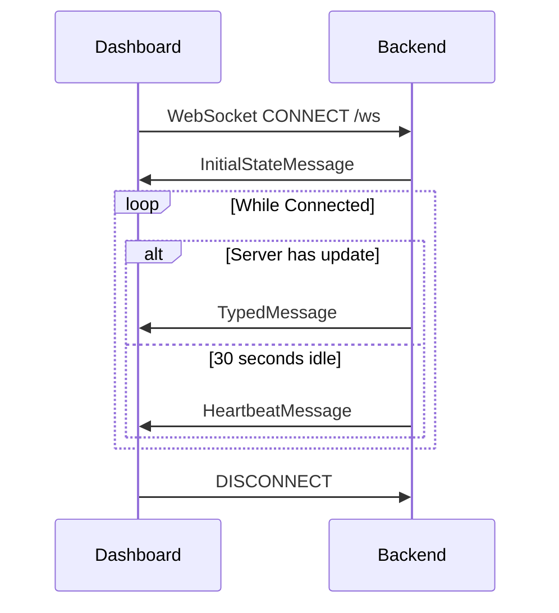

# API Reference

> REST and WebSocket API documentation for Home Hub.

---

## Base URL

```
http://{raspberry-pi-ip}:8000
```

Default port: `8000` (configurable via `PORT` environment variable)

---

## REST Endpoints

### GET `/`

Serves the main dashboard HTML page.

**Response:** `text/html`

---

### GET `/api/config`

Returns frontend configuration values.

**Response:** `application/json`

```json
{
  "google_maps_update_interval": 60000,
  "google_calendar_update_interval": 300000,
  "morning_mode_start": "05:30",
  "day_mode_start": "08:00",
  "night_mode_start": "22:00"
}
```

| Field | Type | Description |
|-------|------|-------------|
| `google_maps_update_interval` | `int` | Map refresh interval (milliseconds) |
| `google_calendar_update_interval` | `int` | Calendar refresh interval (milliseconds) |
| `morning_mode_start` | `string` | Morning kiosk mode start time (HH:MM) |
| `day_mode_start` | `string` | Day kiosk mode start time (HH:MM) |
| `night_mode_start` | `string` | Night kiosk mode start time (HH:MM) |

---

## WebSocket API

### Endpoint

```
ws://{raspberry-pi-ip}:8000/ws
```

### Connection Flow



---

## Message Types

All messages have a `type` field identifying the message type.

### Initial State

Sent immediately upon WebSocket connection.

**Type:** `initial`

```json
{
  "type": "initial",
  "sensors": [
    {"sensor": "bedroom", "prop": "temperature", "temp": 22.5, "ts": "2024-12-24 10:00:00"}
  ],
  "sensor_status": {
    "bedroom": {"online": true, "last_seen": 1703412000.0, "seconds_ago": 5.2}
  },
  "system": {
    "cpu": 15.2,
    "ram_pct": 26.4,
    "ram_used": 2.1,
    "ram_total": 8.0,
    "disk_pct": 19.0,
    "disk_used": 12.2,
    "disk_total": 64.0,
    "net_sent": 1.5,
    "net_recv": 3.2,
    "cpu_temp": 45.0
  },
  "weather": {
    "updated": "10:30",
    "temp": 5,
    "feels": 2,
    "is_day": true,
    "code": 3,
    "desc": "Overcast",
    "wind": 12,
    "hum": 78,
    "pres": 1013,
    "vis": 10,
    "uv": 1,
    "cloud": 85,
    "forecast": {
      "time": ["2024-12-24", "2024-12-25"],
      "temperature_2m_max": [6, 4],
      "temperature_2m_min": [-1, -3],
      "weather_code": [3, 71]
    }
  },
  "nameday": "Adam",
  "health": {
    "mqtt": true,
    "database": true
  },
  "transport": {
    "malesicka": [
      {"line": "146", "direction": "Sídliště Malešice", "mins": 3, "time_scheduled": "10:35:00", "time_predicted": "10:36:00", "delay_minutes": 1, "delay_seconds": 60}
    ],
    "olgy": []
  }
}
```

---

### Sensor Data Update

Sent when new sensor readings are received and stored.

**Type:** `sensors`

```json
{
  "type": "sensors",
  "data": [
    {"sensor": "bedroom", "prop": "temperature", "temp": 22.6, "ts": "2024-12-24 10:05:00"},
    {"sensor": "balcony", "prop": "temperature", "temp": 5.3, "ts": "2024-12-24 10:05:05"},
    {"sensor": "balcony", "prop": "humidity", "temp": 77.8, "ts": "2024-12-24 10:05:05"},
    {"sensor": "balcony", "prop": "pressure", "temp": 1013.5, "ts": "2024-12-24 10:05:05"}
  ]
}
```

---

### Sensor Status Update

Sent when a sensor's online/offline status changes.

**Type:** `sensor_status`

```json
{
  "type": "sensor_status",
  "data": {
    "bedroom": {
      "online": true,
      "last_seen": 1703412300.0,
      "seconds_ago": 2.1
    },
    "balcony": {
      "online": false,
      "last_seen": 1703412200.0,
      "seconds_ago": 102.5
    }
  }
}
```

| Field | Type | Description |
|-------|------|-------------|
| `online` | `bool` | Whether sensor is currently online |
| `last_seen` | `float` | Unix timestamp of last message |
| `seconds_ago` | `float` | Seconds since last message |

---

### Weather Update

Sent when weather data is fetched and has changed.

**Type:** `weather`

```json
{
  "type": "weather",
  "data": {
    "updated": "10:40",
    "temp": 5,
    "feels": 2,
    "is_day": true,
    "code": 3,
    "desc": "Overcast",
    "wind": 12,
    "hum": 78,
    "pres": 1013,
    "vis": 10,
    "uv": 1,
    "cloud": 85,
    "forecast": {
      "time": ["2024-12-24", "2024-12-25", "2024-12-26", "2024-12-27", "2024-12-28", "2024-12-29", "2024-12-30"],
      "temperature_2m_max": [6, 4, 5, 3, 2, 4, 6],
      "temperature_2m_min": [-1, -3, -2, -4, -5, -3, -1],
      "weather_code": [3, 71, 61, 71, 71, 3, 0]
    }
  }
}
```

| Field | Type | Description |
|-------|------|-------------|
| `updated` | `string` | Time of last update (HH:MM) |
| `temp` | `int` | Current temperature (°C) |
| `feels` | `int` | Feels-like temperature (°C) |
| `is_day` | `bool` | Whether it's daytime |
| `code` | `int` | WMO weather code |
| `desc` | `string` | Weather description |
| `wind` | `int` | Wind speed (km/h) |
| `hum` | `int` | Humidity (%) |
| `pres` | `int` | Pressure (hPa) |
| `vis` | `int` | Visibility (km) |
| `uv` | `int` | UV index |
| `cloud` | `int` | Cloud cover (%) |
| `forecast` | `object` | 7-day forecast data |

---

### Nameday Update

Sent when nameday data is fetched.

**Type:** `nameday`

```json
{
  "type": "nameday",
  "data": "Adam"
}
```

---

### System Stats Update

Sent every 2 seconds with host system metrics.

**Type:** `system`

```json
{
  "type": "system",
  "data": {
    "cpu": 18.5,
    "ram_pct": 27.1,
    "ram_used": 2.17,
    "ram_total": 8.0,
    "disk_pct": 19.0,
    "disk_used": 12.2,
    "disk_total": 64.0,
    "net_sent": 2.3,
    "net_recv": 4.1,
    "cpu_temp": 46.0
  }
}
```

| Field | Type | Unit | Description |
|-------|------|------|-------------|
| `cpu` | `float` | % | CPU usage percentage |
| `ram_pct` | `float` | % | RAM usage percentage |
| `ram_used` | `float` | GB | Used RAM |
| `ram_total` | `float` | GB | Total RAM |
| `disk_pct` | `float` | % | Disk usage percentage |
| `disk_used` | `float` | GB | Used disk space |
| `disk_total` | `float` | GB | Total disk space |
| `net_sent` | `float` | KB/s | Network upload rate |
| `net_recv` | `float` | KB/s | Network download rate |
| `cpu_temp` | `float?` | °C | CPU temperature (null if unavailable) |

---

### Transport Update

Sent when bus departure data changes.

**Type:** `transport`

```json
{
  "type": "transport",
  "data": {
    "malesicka": [
      {
        "line": "146",
        "direction": "Sídliště Malešice",
        "mins": 3,
        "time_scheduled": "10:35:00",
        "time_predicted": "10:36:00",
        "delay_minutes": 1,
        "delay_seconds": 60
      },
      {
        "line": "155",
        "direction": "Želivského",
        "mins": 7,
        "time_scheduled": "10:40:00",
        "time_predicted": "10:40:00",
        "delay_minutes": 0,
        "delay_seconds": 0
      }
    ],
    "olgy": [
      {
        "line": "133",
        "direction": "Florenc",
        "mins": 5,
        "time_scheduled": "10:38:00",
        "time_predicted": "10:38:00",
        "delay_minutes": 0,
        "delay_seconds": 0
      }
    ]
  }
}
```

| Field | Type | Description |
|-------|------|-------------|
| `line` | `string` | Bus line number |
| `direction` | `string` | Destination/headsign |
| `mins` | `int` | Minutes until departure |
| `time_scheduled` | `string` | Scheduled time (HH:MM:SS) |
| `time_predicted` | `string` | Predicted time (HH:MM:SS) |
| `delay_minutes` | `int` | Delay in minutes |
| `delay_seconds` | `int` | Delay in seconds |

---

### Heartbeat

Sent every 30 seconds if no other messages were sent (keep-alive).

**Type:** `heartbeat`

```json
{
  "type": "heartbeat"
}
```

---

## Error Responses

### HTTP Errors

| Status | Meaning |
|--------|---------|
| `404` | Page not found |
| `500` | Internal server error |

### WebSocket Errors

WebSocket connections are automatically closed on errors. The client should implement reconnection logic:

```javascript
ws.onclose = () => setTimeout(connect, 3000);
```

---

## Rate Limits

| Endpoint | Limit |
|----------|-------|
| REST API | None (local use) |
| WebSocket | 1 connection per client recommended |

---

## CORS

CORS is configured for local development:

```python
allow_origins=[
    "http://localhost:8000",
    "http://127.0.0.1:8000",
    "http://localhost:63343",  # PyCharm dev server
]
```

For production on Raspberry Pi, requests come from same origin (served HTML).

