# System Architecture

> Deep dive into the Home Hub architecture, design patterns, and component interactions.

---

## High-Level Architecture

```mermaid
flowchart LR
    subgraph Edge["Edge Layer"]
        S1["🌡️ DS18B20<br/>Temperature"]
        S2["🌡️ DS18B20<br/>Temperature"]
        S3["📊 BME280<br/>Multi-Sensor"]
    end

    subgraph Transport["Transport Layer"]
        MQTT["📡 Mosquitto<br/>MQTT Broker"]
    end

    subgraph Core["Application Core"]
        API["🔌 FastAPI<br/>Server"]
        WS["🔄 WebSocket<br/>Manager"]
        BG["⏱️ Background<br/>Tasks"]
    end

    subgraph Data["Data Layer"]
        DB[(💾 SQLite)]
        CACHE["📋 In-Memory<br/>Cache"]
    end

    subgraph Presentation["Presentation Layer"]
        WEB["📺 Dashboard"]
    end

    S1 & S2 & S3 --> MQTT
    MQTT --> API
    API <--> DB
    API --> CACHE
    BG --> CACHE
    API <--> WS
    WS <--> WEB
    CACHE --> WS

    style Edge fill:#e0f2fe,stroke:#0284c7
    style Transport fill:#fee2e2,stroke:#dc2626
    style Core fill:#dcfce7,stroke:#16a34a
    style Data fill:#fef3c7,stroke:#d97706
    style Presentation fill:#f3e8ff,stroke:#9333ea
```



---

## Design Principles

### 1. Event-Driven Architecture

The system uses an event-driven approach where data flows through the system reactively:

- **MQTT Messages**: Sensors publish data on topics, server subscribes and reacts
- **WebSocket Broadcasts**: State changes trigger immediate client updates
- **Background Tasks**: Periodic fetches that broadcast on data change

### 2. Separation of Concerns


### 3. Typed Data Models

All data flowing through the system uses strongly-typed dataclasses:


---

## Message Flow Patterns

### Pattern 1: Sensor Data Ingestion


### Pattern 2: Client Connection


### Pattern 3: External API Polling


---

## Component Interactions

### Application Lifecycle


### Background Task Coordination

```mermaid
flowchart TB
    subgraph Lifespan["FastAPI Lifespan Context"]
        INIT["Initialization"]
        YIELD["yield (app running)"]
        CLEANUP["Cleanup"]
    end

    subgraph Tasks["Concurrent Tasks"]
        T1["🖥️ System Monitor<br/>Every 2s"]
        T2["🌤️ Weather Update<br/>Every 10min"]
        T3["📅 Nameday Update<br/>Every 6h"]
        T4["🚌 Bus Update<br/>Every 30s"]
        T5["🔍 Sensor Status<br/>Every 5s"]
    end

    INIT --> |"asyncio.create_task()"| T1 & T2 & T3 & T4 & T5
    T1 & T2 & T3 & T4 & T5 --> |"running"| YIELD
    YIELD --> |"task.cancel()"| CLEANUP

    style Tasks fill:#dcfce7
```



---

## Thread Safety

The application handles threading carefully due to MQTT callbacks running in a separate thread:


The `_main_loop` reference is captured at startup and used for thread-safe coroutine scheduling:

```python
# Captured in lifespan
_main_loop = asyncio.get_running_loop()

# Used in MQTT callback (different thread)
asyncio.run_coroutine_threadsafe(
    broadcast_sensor_update(name, prop, val),
    _main_loop
)
```

---

## Error Handling Strategy


---

## Scalability Considerations

### Current Design (Single Node)

The current architecture is optimized for single Raspberry Pi deployment:

- SQLite for simplicity and low resource usage
- In-memory caching for frequently accessed data
- Single WebSocket manager instance

### Potential Scaling Points

| Component | Current | Scalable Alternative |
|-----------|---------|---------------------|
| Database | SQLite | PostgreSQL, TimescaleDB |
| Message Queue | In-memory | Redis Pub/Sub |
| WebSocket | Single instance | Redis-backed adapter |
| Caching | Dict/variables | Redis |


