# Backend Documentation

> Server-side components, APIs, data models, and background tasks.

---

## Application Structure

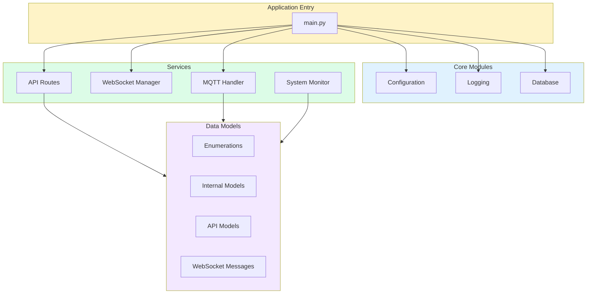

---

## Configuration

All configuration is managed through environment variables with sensible defaults:

### Environment Variables

| Variable | Default | Description |
|----------|---------|-------------|
| **MQTT** | | |
| `MQTT_BROKER` | `localhost` | MQTT broker hostname |
| `MQTT_PORT` | `1883` | MQTT broker port |
| `MQTT_USER` | `None` | MQTT username (optional) |
| `MQTT_PASS` | `None` | MQTT password (optional) |
| `MQTT_KEEPALIVE` | `60` | Keepalive interval in seconds |
| **Server** | | |
| `HOST` | `0.0.0.0` | Server bind address |
| `PORT` | `8000` | Server port |
| `LOG_LEVEL` | `INFO` | Logging level |
| **External APIs** | | |
| `GOLEMIO_API_KEY` | `None` | Prague transport API key |
| `LOCATION_LATITUDE` | `50.0878433` | Location for weather |
| `LOCATION_LONGITUDE` | `14.478581` | Location for weather |
| **Update Intervals** | | |
| `WEATHER_UPDATE_INTERVAL` | `600` | Weather fetch interval (10 min) |
| `NAMEDAY_UPDATE_INTERVAL` | `21600` | Nameday fetch interval (6 hours) |
| `BUS_UPDATE_INTERVAL` | `30` | Transport fetch interval |
| `SYSTEM_MONITOR_INTERVAL` | `2` | System stats interval |
| `MQTT_SAVE_THROTTLE` | `5` | Min seconds between DB saves |
| **Sensor Status** | | |
| `SENSOR_OFFLINE_TIMEOUT` | `30` | Seconds before marking offline |
| `SENSOR_STATUS_CHECK_INTERVAL` | `5` | Status check interval |
| **Kiosk Mode** | | |
| `MORNING_MODE_START` | `05:30` | Morning mode start time |
| `DAY_MODE_START` | `08:00` | Day mode start time |
| `NIGHT_MODE_START` | `22:00` | Night mode start time |

---

## MQTT Handler

Manages communication with IoT sensors via MQTT protocol.

### Topic Structure

```
pico/{property}/{sensor_name}
```

**Examples:**
- `pico/temperature/bedroom` - Bedroom temperature
- `pico/temperature/livingroom` - Living room temperature
- `pico/temperature/balcony` - Balcony temperature
- `pico/humidity/balcony` - Balcony humidity
- `pico/pressure/balcony` - Balcony pressure

### Message Flow

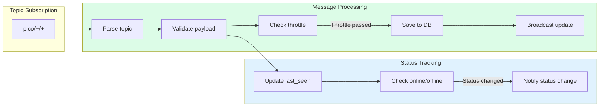

### Sensor Status Tracking

The system tracks sensor online/offline status:

- **Online**: Last message received within `SENSOR_OFFLINE_TIMEOUT` seconds
- **Offline**: No message received for `SENSOR_OFFLINE_TIMEOUT` seconds

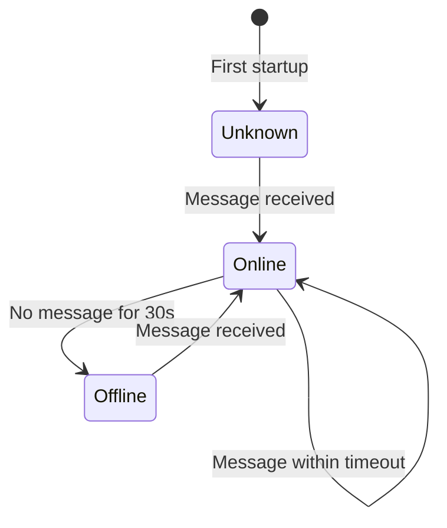

---

## WebSocket Manager

Handles real-time communication with connected dashboard clients.

### Connection Lifecycle

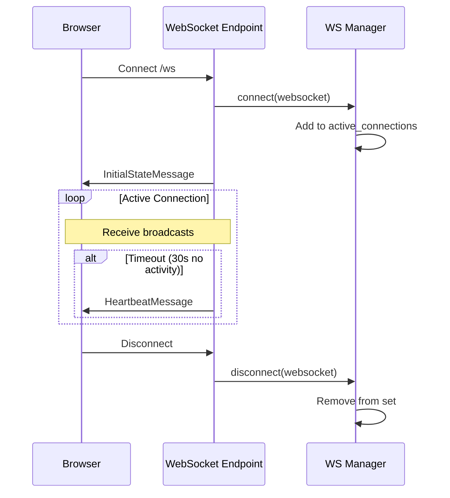

### Message Types

| Type | Direction | Payload | Description |
|------|-----------|---------|-------------|
| `initial` | Server → Client | Full state | Sent on connection |
| `sensors` | Server → Client | Sensor readings | Sensor data update |
| `sensor_status` | Server → Client | Status map | Online/offline changes |
| `weather` | Server → Client | Weather data | Weather update |
| `nameday` | Server → Client | String | Nameday update |
| `system` | Server → Client | System stats | Host metrics |
| `transport` | Server → Client | Bus departures | Transport update |
| `heartbeat` | Server → Client | None | Keep-alive |

---

## Background Tasks

### Task Overview

```mermaid
gantt
    title Background Task Intervals
    dateFormat X
    axisFormat %s

    section System Monitor
    Collect metrics :active, 0, 2
    Collect metrics :active, 2, 4
    Collect metrics :active, 4, 6

    section Sensor Status
    Check timeouts :crit, 0, 5
    Check timeouts :crit, 5, 10

    section Bus Updates
    Fetch departures :done, 0, 30
    Fetch departures :done, 30, 60

    section Weather
    Fetch weather :milestone, 0, 600
```

### System Monitor

Collects host system metrics using `psutil`:

| Metric | Source | Update Rate |
|--------|--------|-------------|
| CPU % | `psutil.cpu_percent()` | 2 seconds |
| RAM | `psutil.virtual_memory()` | 2 seconds |
| Disk | `psutil.disk_usage()` | 2 seconds |
| Network I/O | `psutil.net_io_counters()` | 2 seconds |
| CPU Temperature | `psutil.sensors_temperatures()` | 2 seconds |

Temperature sensors are checked in priority order:
1. `cpu_thermal` (Raspberry Pi)
2. `coretemp` (Intel)
3. `k10temp` (AMD)
4. `acpitz` (ACPI)

### Weather Fetcher

Fetches weather data from Open-Meteo API:

**Current Weather Parameters:**
- Temperature (2m)
- Apparent temperature (feels like)
- Is day/night
- Weather code (WMO standard)
- Wind speed
- Humidity
- Pressure
- UV Index
- Cloud cover
- Visibility

**Forecast:**
- 7-day forecast
- Daily max/min temperatures
- Weather codes

### Transport Fetcher

Fetches Prague public transport departures from Golemio API:

**Bus Stops Monitored:**
- Malešická (`U357Z1P`) - Lines 146, 155
- Olgy Havlové (`U1064Z2P`) - Line 133

**Data Retrieved:**
- Line number
- Direction/headsign
- Scheduled time
- Predicted time
- Delay (minutes/seconds)

### Nameday Fetcher

Fetches Slovak nameday from nameday.abalin.net API every 6 hours.

---

## Data Models

### Sensor Models

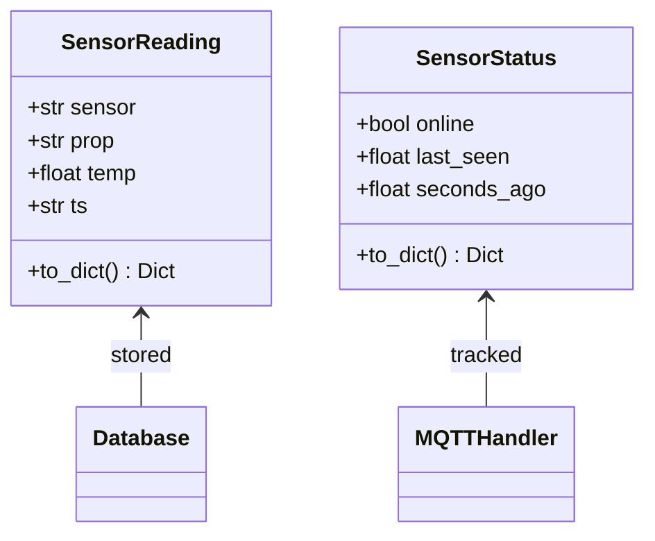

### Weather Models

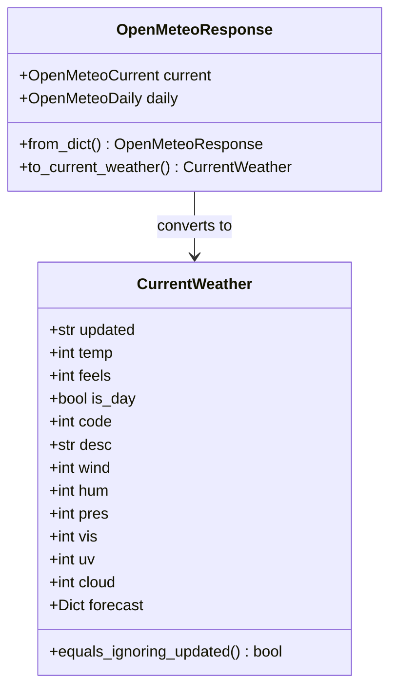

### Nameday Models

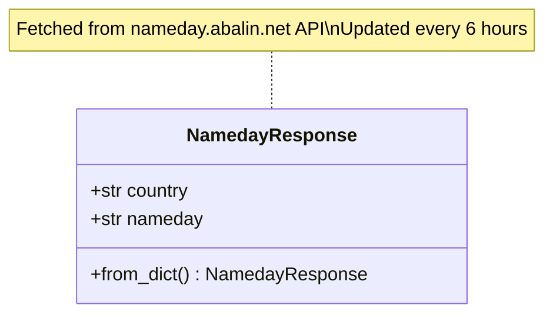

### Transport Models

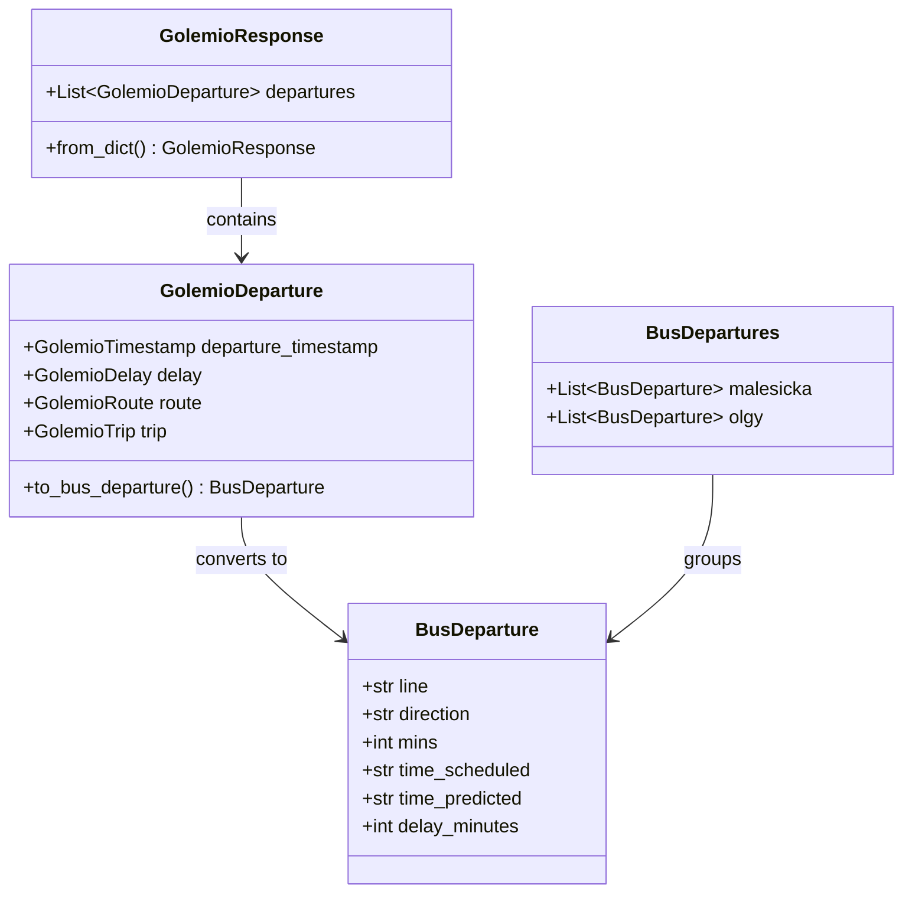

### WebSocket Messages

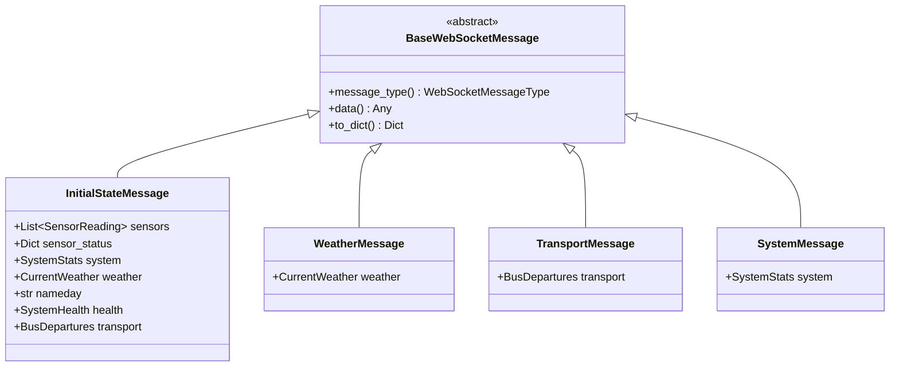

---

## External API Integration

### API Endpoints Used

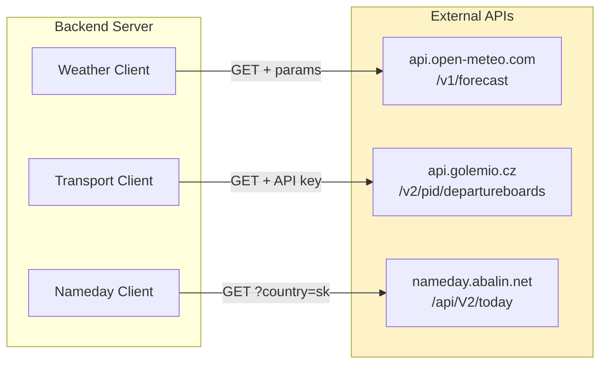

### Error Handling

All external API calls handle:
- **Timeouts**: 10 second timeout, logged as warning
- **HTTP Errors**: Non-200 status codes logged
- **Parse Errors**: Invalid JSON logged
- **Network Errors**: Connection failures logged

Failed requests do not crash the background task - they continue on the next interval.

