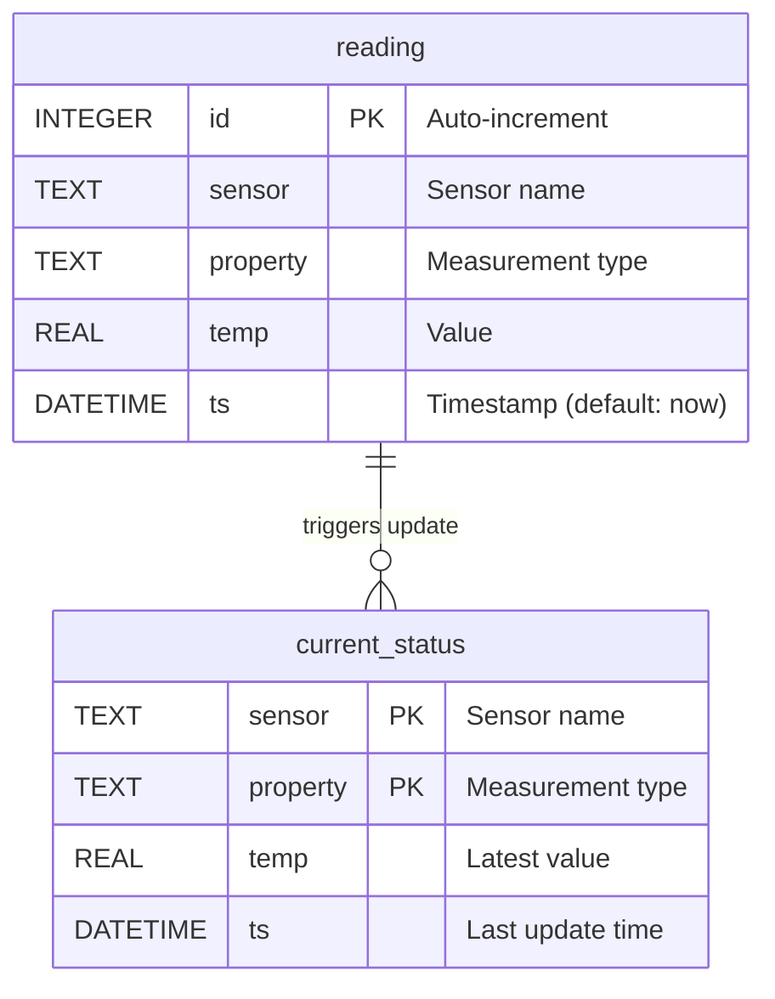
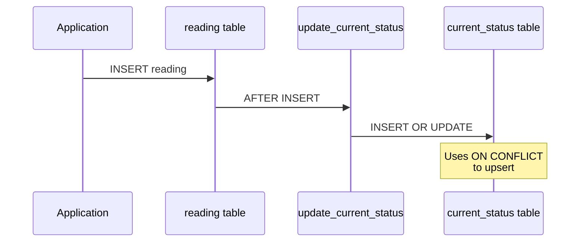
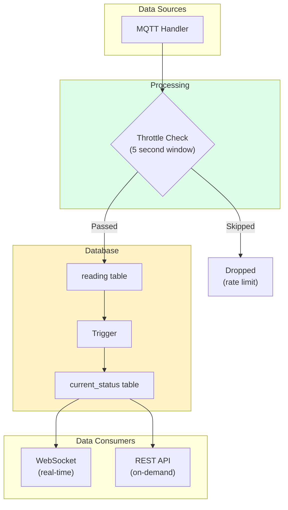
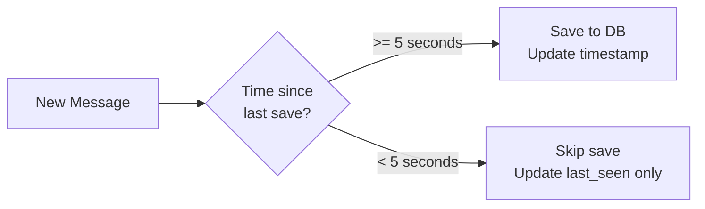
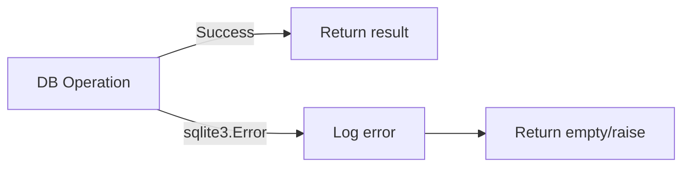

# Database Documentation

> SQLite database schema, queries, and data management patterns.

---

## Overview

Home Hub uses SQLite as its persistence layer, chosen for:
- **Simplicity**: Single file, no separate server process
- **Low footprint**: Minimal resource usage on Raspberry Pi
- **Reliability**: ACID-compliant with WAL mode enabled

---

## Database Location

```
{project_root}/sensors.db
```

Configured via `DB_NAME` environment variable (default: `sensors.db`).

---

## Schema



### Tables

#### `reading` - Historical Sensor Data

Stores all sensor readings for historical analysis.

| Column | Type | Constraints | Description |
|--------|------|-------------|-------------|
| `id` | INTEGER | PRIMARY KEY, AUTOINCREMENT | Unique reading ID |
| `sensor` | TEXT | NOT NULL | Sensor identifier (e.g., "bedroom") |
| `property` | TEXT | NOT NULL | Measurement type (e.g., "temperature") |
| `temp` | REAL | NOT NULL | Measured value |
| `ts` | DATETIME | DEFAULT CURRENT_TIMESTAMP | Recording timestamp |

#### `current_status` - Live Sensor Values

Holds only the most recent reading per sensor/property combination.

| Column | Type | Constraints | Description |
|--------|------|-------------|-------------|
| `sensor` | TEXT | PRIMARY KEY (composite) | Sensor identifier |
| `property` | TEXT | PRIMARY KEY (composite) | Measurement type |
| `temp` | REAL | NOT NULL | Current value |
| `ts` | DATETIME | NOT NULL | Last update time |

---

## Automatic Status Updates

A trigger automatically maintains `current_status` when new readings are inserted:



### Trigger Definition

```sql
CREATE TRIGGER update_current_status 
AFTER INSERT ON reading
BEGIN
    INSERT INTO current_status (sensor, property, temp, ts) 
    VALUES (NEW.sensor, NEW.property, NEW.temp, NEW.ts)
    ON CONFLICT(sensor, property) 
    DO UPDATE SET temp = excluded.temp, ts = excluded.ts;
END
```

This ensures:
- New sensor/property combinations are inserted
- Existing combinations are updated with latest values
- No manual current_status maintenance required

---

## Write-Ahead Logging (WAL)

WAL mode is enabled at database initialization:

```sql
PRAGMA journal_mode=WAL;
```

### Benefits

| Feature | Benefit |
|---------|---------|
| **Concurrent reads** | Readers don't block writers |
| **Better performance** | Especially for write-heavy workloads |
| **Crash recovery** | Atomic commits with faster recovery |
| **Reduced I/O** | Fewer fsync operations |

---

## Data Flow



---

## Throttling

To prevent database bloat from high-frequency sensor updates, writes are throttled:

| Setting | Default | Description |
|---------|---------|-------------|
| `MQTT_SAVE_THROTTLE` | 5 seconds | Minimum interval between saves per sensor/property |

### Throttle Logic



This means:
- Sensor status tracking (online/offline) is always current
- Database writes happen at most every 5 seconds per measurement
- High-frequency sensor data doesn't overwhelm storage

---

## Common Queries

### Get Current Status (All Sensors)

```sql
SELECT sensor, property, temp, ts 
FROM current_status 
ORDER BY sensor, property;
```

Returns the latest reading for each sensor/property combination.

### Save New Reading

```sql
INSERT INTO reading (sensor, property, temp) 
VALUES (?, ?, ?);
```

The trigger automatically updates `current_status`.

### Get Historical Readings (Example)

```sql
SELECT sensor, property, temp, ts 
FROM reading 
WHERE sensor = 'bedroom' 
  AND ts >= datetime('now', '-24 hours')
ORDER BY ts DESC;
```

---

## Example Data

### reading table

| id | sensor | property | temp | ts |
|----|--------|----------|------|-----|
| 1 | bedroom | temperature | 22.5 | 2024-12-24 10:00:00 |
| 2 | balcony | temperature | 5.2 | 2024-12-24 10:00:05 |
| 3 | balcony | humidity | 78.3 | 2024-12-24 10:00:05 |
| 4 | balcony | pressure | 1013.2 | 2024-12-24 10:00:05 |
| 5 | bedroom | temperature | 22.6 | 2024-12-24 10:05:00 |

### current_status table

| sensor | property | temp | ts |
|--------|----------|------|-----|
| balcony | humidity | 78.3 | 2024-12-24 10:00:05 |
| balcony | pressure | 1013.2 | 2024-12-24 10:00:05 |
| balcony | temperature | 5.2 | 2024-12-24 10:00:05 |
| bedroom | temperature | 22.6 | 2024-12-24 10:05:00 |
| livingroom | temperature | 21.8 | 2024-12-24 10:04:30 |

---

## Database Maintenance

### Size Management

Over time, the `reading` table will grow. Consider periodic cleanup:

```sql
-- Delete readings older than 30 days
DELETE FROM reading 
WHERE ts < datetime('now', '-30 days');

-- Reclaim disk space
VACUUM;
```

### Backup

```bash
# Simple file copy (when server stopped)
cp sensors.db sensors.db.backup

# Or use SQLite backup API (while running)
sqlite3 sensors.db ".backup sensors.db.backup"
```

### Monitoring

```sql
-- Table sizes
SELECT name, 
       (SELECT COUNT(*) FROM reading) as reading_count,
       (SELECT COUNT(*) FROM current_status) as status_count;

-- Database file size
-- (Check externally with ls -la sensors.db)
```

---

## Error Handling

Database operations are wrapped in try/except blocks:

| Error Type | Handling |
|------------|----------|
| Connection failed | Raise exception (startup failure) |
| Write failed | Log error, continue operation |
| Read failed | Log error, return empty list |



