# Deployment Guide

> Setting up Home Hub on Raspberry Pi 5 for production use.

---

## Hardware Requirements

### Server (Hub)

| Component | Specification |
|-----------|--------------|
| **Device** | Raspberry Pi 5 (4GB+ RAM recommended) |
| **Storage** | 32GB+ microSD or USB SSD |
| **Network** | Ethernet or WiFi |
| **Display** | HDMI display (for kiosk mode) |

### IoT Sensors

| Component | Quantity | Purpose |
|-----------|----------|---------|
| Raspberry Pi Pico 2W | 2-3 | Sensor microcontrollers |
| DS18B20 | 2 | Temperature sensors |
| BME280 | 1 | Multi-sensor (temp/humidity/pressure) |
| 4.7kΩ resistor | 2 | DS18B20 pull-up |
| Breadboard + wires | - | Prototyping |

---

## Network Architecture

```mermaid
flowchart TB
    subgraph Network["Local Network"]
        ROUTER["🌐 Router<br/>192.168.0.1"]
        
        subgraph Hub["Raspberry Pi 5 Hub"]
            PI5["📺 Home Hub<br/>192.168.0.50:8000"]
            MQTT["📡 Mosquitto<br/>192.168.0.50:1883"]
        end
        
        subgraph Sensors["IoT Sensors"]
            PICO1["🌡️ Bedroom<br/>192.168.0.51"]
            PICO2["🌡️ Living Room<br/>192.168.0.52"]
            PICO3["📊 Balcony<br/>192.168.0.53"]
        end
    end

    ROUTER --> PI5
    ROUTER --> PICO1 & PICO2 & PICO3
    PICO1 & PICO2 & PICO3 -->|"MQTT"| MQTT

    style Hub fill:#dcfce7
    style Sensors fill:#e0f2fe
```



---

## Raspberry Pi 5 Setup

### 1. Initial OS Setup

```bash
# Update system
sudo apt update && sudo apt upgrade -y

# Install required packages
sudo apt install -y python3 python3-pip python3-venv mosquitto mosquitto-clients chromium-browser
```

### 2. Install Mosquitto MQTT Broker

```bash
# Install
sudo apt install -y mosquitto mosquitto-clients

# Enable and start
sudo systemctl enable mosquitto
sudo systemctl start mosquitto

# Test (in separate terminals)
mosquitto_sub -t "test/#" -v
mosquitto_pub -t "test/hello" -m "world"
```

#### Mosquitto Configuration (optional authentication)

Edit `/etc/mosquitto/mosquitto.conf`:

```conf
listener 1883
allow_anonymous false
password_file /etc/mosquitto/passwd
```

Create password file:

```bash
sudo mosquitto_passwd -c /etc/mosquitto/passwd pico_bedroom
sudo mosquitto_passwd /etc/mosquitto/passwd pico_livingroom
sudo mosquitto_passwd /etc/mosquitto/passwd pico_balcony
sudo systemctl restart mosquitto
```

---

### 3. Deploy Home Hub Application

```bash
# Clone repository
cd ~
git clone <repository-url> HomeHub
cd HomeHub

# Create virtual environment
python3 -m venv venv
source venv/bin/activate

# Install dependencies
pip install -r requirements.txt

# Configure environment
cp .env.example .env
nano .env
```

#### Environment Configuration

Edit `.env`:

```bash
# MQTT
MQTT_BROKER=localhost
MQTT_PORT=1883
MQTT_USER=           # Leave empty if no auth
MQTT_PASS=

# Server
HOST=0.0.0.0
PORT=8000
LOG_LEVEL=INFO

# External APIs
GOLEMIO_API_KEY=your_api_key_here

# Location (for weather)
LOCATION_LATITUDE=50.0878433
LOCATION_LONGITUDE=14.478581

# Kiosk mode times
MORNING_MODE_START=05:30
DAY_MODE_START=08:00
NIGHT_MODE_START=22:00
```

---

### 4. Create systemd Service

```bash
# Copy service file
sudo cp service.toml /etc/systemd/system/homehub.service
```

Edit `/etc/systemd/system/homehub.service`:

```ini
[Unit]
Description=HomeHub Dashboard Backend
After=network.target mosquitto.service

[Service]
User=pi
WorkingDirectory=/home/pi/HomeHub
ExecStart=/home/pi/HomeHub/venv/bin/python main.py
Restart=always
RestartSec=5
StandardOutput=inherit
StandardError=inherit

[Install]
WantedBy=multi-user.target
```

Enable and start:

```bash
sudo systemctl daemon-reload
sudo systemctl enable homehub
sudo systemctl start homehub

# Check status
sudo systemctl status homehub

# View logs
journalctl -u homehub -f
```

---

### 5. Kiosk Mode Setup (Chromium)

Create autostart script:

```bash
mkdir -p ~/.config/autostart
nano ~/.config/autostart/kiosk.desktop
```

Content:

```ini
[Desktop Entry]
Type=Application
Name=Home Hub Kiosk
Exec=/home/pi/HomeHub/start-kiosk.sh
```

Create `/home/pi/HomeHub/start-kiosk.sh`:

```bash
#!/bin/bash

# Wait for network and server
sleep 10

# Disable screen blanking
xset s off
xset -dpms
xset s noblank

# Start Chromium in kiosk mode
chromium-browser \
    --kiosk \
    --noerrdialogs \
    --disable-infobars \
    --disable-session-crashed-bubble \
    --incognito \
    http://localhost:8000
```

Make executable:

```bash
chmod +x /home/pi/HomeHub/start-kiosk.sh
```

---

## IoT Sensor Deployment

### 1. Flash MicroPython

1. Download MicroPython for Pico 2W from [micropython.org](https://micropython.org/download/RPI_PICO2_W/)
2. Hold BOOTSEL button and connect Pico via USB
3. Copy `.uf2` file to the mounted drive

### 2. Upload Sensor Code

Using Thonny IDE:

1. Connect Pico via USB
2. Copy required files:
   - `config.py` - WiFi and MQTT credentials
   - `main.py` - Main sensor code
   - `umqtt/` folder - MQTT library
   - `BME280.py` - (for multi-sensor only)

### 3. Configure Static IPs

Edit `config.py` on each Pico:

**Bedroom:**
```python
wifi_ssid = 'YourWiFi'
wifi_password = 'YourPassword'
mqtt_server = b'192.168.0.50'
mqtt_username = b'pico_bedroom'
mqtt_password = b'password'
```

**Balcony (in main.py):**
```python
STATIC_IP = '192.168.0.53'
MQTT_TOPIC_TEMPERATURE = 'pico/temperature/balcony'
MQTT_TOPIC_HUMIDITY = 'pico/humidity/balcony'
MQTT_TOPIC_PRESSURE = 'pico/pressure/balcony'
```

---

## Startup Sequence


---

## Monitoring & Maintenance

### Check Service Status

```bash
# Home Hub status
sudo systemctl status homehub

# Mosquitto status
sudo systemctl status mosquitto

# View logs
journalctl -u homehub -f --since "1 hour ago"
```

### Database Maintenance

```bash
# Check database size
ls -lh ~/HomeHub/sensors.db

# Clean old data (optional)
sqlite3 ~/HomeHub/sensors.db "DELETE FROM reading WHERE ts < datetime('now', '-30 days');"
sqlite3 ~/HomeHub/sensors.db "VACUUM;"
```

### Restart Services

```bash
sudo systemctl restart homehub
sudo systemctl restart mosquitto
```

---

## Troubleshooting

### Common Issues

| Problem | Solution |
|---------|----------|
| Dashboard blank | Check `systemctl status homehub` |
| No sensor data | Verify Mosquitto is running, check Pico LED patterns |
| Weather not updating | Check `LOCATION_*` env vars and network |
| Transport not updating | Verify `GOLEMIO_API_KEY` is set |
| Kiosk not starting | Check `~/.config/autostart/kiosk.desktop` |

### Sensor LED Patterns

| Pattern | Meaning |
|---------|---------|
| Slow blink | WiFi connecting |
| 2 quick blinks | Connected successfully |
| 3 medium blinks | WiFi error |
| 4 fast blinks | MQTT error |
| Brief off-pulse | Data sent (heartbeat) |

### Test MQTT

```bash
# Subscribe to all sensor topics
mosquitto_sub -h localhost -t "pico/#" -v

# Should see:
# pico/temperature/bedroom 22.5
# pico/temperature/balcony 5.2
# pico/humidity/balcony 78.3
```

---

## Security Considerations

| Area | Recommendation |
|------|----------------|
| **Network** | Use dedicated IoT VLAN if possible |
| **MQTT** | Enable authentication, use unique passwords per device |
| **Firewall** | Allow only ports 1883 (MQTT) and 8000 (HTTP) from local network |
| **Updates** | Keep OS and dependencies updated |
| **Physical** | Secure Raspberry Pi access |

### Basic Firewall Setup

```bash
sudo apt install ufw
sudo ufw default deny incoming
sudo ufw allow ssh
sudo ufw allow 8000/tcp   # Home Hub
sudo ufw allow 1883/tcp   # MQTT (from local only)
sudo ufw enable
```

