# Frontend Documentation

> Dashboard UI, WebSocket communication, kiosk modes, and client-side architecture.

---

## Dashboard Layout

```mermaid
flowchart TB
    subgraph Layout["Dashboard Grid Layout"]
        subgraph Top["Top Container (4 columns)"]
            MAP1["🗺️ Traffic Map 1<br/>Direct Route"]
            MAP2["🗺️ Traffic Map 2<br/>Via Waypoint"]
            CAL1["📅 Calendar 1"]
            CAL2["📅 Calendar 2"]
        end
        
        subgraph Bottom["Bottom Container (3 columns)"]
            LEFT["⏰ Clock & System<br/>Health Status"]
            CENTER["🌤️ Weather Panel<br/>Home Sensors"]
            RIGHT["🚌 Transport<br/>Bus Departures"]
        end
    end

    style Top fill:#e0f2fe
    style Bottom fill:#dcfce7
```



---

## Module Architecture

The frontend is organized into focused JavaScript modules:


### Module Responsibilities

| Module | Responsibility |
|--------|----------------|
| `constants.js` | Enums, element IDs, CSS classes, config values |
| `clock.js` | Real-time clock display, date formatting |
| `iframe.js` | Google Maps and Calendar iframe refresh |
| `weather.js` | Weather icon mapping, dynamic backgrounds |
| `transport.js` | Bus departure list rendering |
| `updates.js` | DOM updates for all data types |
| `websocket.js` | WebSocket connection, message routing |
| `kiosk.js` | Time-based display mode switching |
| `app.js` | Application initialization, config fetch |

---

## WebSocket Communication

### Connection Flow


### Message Type Handling

```javascript
// Message type routing
switch (msg.type) {
    case 'initial':     // Full state on connect
    case 'sensors':     // Sensor readings
    case 'sensor_status': // Online/offline
    case 'weather':     // Weather data
    case 'nameday':     // Nameday string
    case 'system':      // Host metrics
    case 'transport':   // Bus departures
    case 'heartbeat':   // Keep-alive
}
```

---

## Kiosk Display Modes

The dashboard automatically adjusts based on time of day:


### Mode Configuration

| Mode | Time Range | Visible Elements |
|------|------------|------------------|
| **Morning** | 05:30 - 08:00 | Everything |
| **Day** | 08:00 - 22:00 | Calendars, Weather, Transport, Clock |
| **Night** | 22:00 - 05:30 | Clock only |

### CSS Classes Applied


---

## Weather Display

### Weather Icons

Weather codes are mapped to Lucide icons:

| Code Range | Condition | Icon |
|------------|-----------|------|
| 0 | Clear sky | `sun` |
| 1-3 | Partly cloudy | `cloud-sun` |
| 45-48 | Fog | `cloud` |
| 51-67 | Rain/Drizzle | `cloud-rain` |
| 71-77 | Snow | `cloud-snow` |
| 80-82 | Rain showers | `cloud-rain` |
| 85-86 | Snow showers | `cloud-snow` |
| 95-99 | Thunderstorm | `cloud-lightning` |

### Dynamic Backgrounds

The weather panel changes background based on conditions:

```mermaid
flowchart LR
    CODE["Weather Code"]
    
    CODE --> |"0-1 + day"| CLEAR_DAY["☀️ Clear Day<br/>Blue gradient"]
    CODE --> |"0-1 + night"| CLEAR_NIGHT["🌙 Clear Night<br/>Dark blue"]
    CODE --> |"2-48"| CLOUDY["☁️ Cloudy<br/>Gray gradient"]
    CODE --> |"51-82"| RAINY["🌧️ Rainy<br/>Blue-gray"]
    CODE --> |"71-86"| SNOWY["❄️ Snowy<br/>White-blue"]
    CODE --> |"95+"| STORM["⛈️ Storm<br/>Dark purple"]
```



---

## Sensor Display

### Sensor Status Indicators

Each sensor has a colored status dot:

```mermaid
flowchart LR
    STATUS["Sensor Status"]
    
    STATUS --> |"online: true"| GREEN["🟢 Green dot<br/>status-online"]
    STATUS --> |"online: false"| RED["🔴 Red dot<br/>status-offline"]

    style GREEN fill:#22c55e
    style RED fill:#ef4444
```



### Sensor to Element Mapping

| Sensor Name | Display Location | Data Shown |
|-------------|------------------|------------|
| `bedroom` | Bedroom card | Temperature |
| `livingroom` | Living Room card | Temperature |
| `balcony` | Balcony card | Temperature, Humidity, Pressure |

---

## Transport Display

Bus departures are rendered with:
- Line number (badge style)
- Direction/headsign
- Scheduled time
- Predicted time (with delay indicator)
- Minutes until departure

```mermaid
flowchart TB
    subgraph BusItem["Bus Departure Item"]
        LINE["🔵 Line 146"]
        DIR["Direction: Sídliště Malešice"]
        TIMES["Scheduled: 14:30 | Predicted: 14:32"]
        MINS["⏱️ 5 min"]
    end

    style BusItem fill:#e0f2fe
```



### Urgency Styling

Departures within 2 minutes get urgent styling (red background).

---

## System Information Display

```mermaid
flowchart TB
    subgraph SystemPanel["System Monitor Panel"]
        subgraph Health["Health Status"]
            MQTT["MQTT 🟢"]
            DB["Database 🟢"]
        end
        
        subgraph Resources["Resource Usage"]
            CPU["CPU: 15%<br/>45°C"]
            RAM["RAM: 2.1GB / 8GB<br/>26%"]
            DISK["Disk: 12GB / 64GB<br/>19%"]
        end
    end

    style Health fill:#dcfce7
    style Resources fill:#e0f2fe
```



---

## External Embeds

### Google Maps

Traffic maps are embedded using Google Maps Embed API:

```
https://www.google.com/maps/embed/v1/directions
  ?key={API_KEY}
  &origin={ORIGIN}
  &destination={DESTINATION}
  &waypoints={OPTIONAL_WAYPOINT}
  &mode=driving
```

### Google Calendar

Calendars are embedded using Google Calendar embed:

```
https://calendar.google.com/calendar/embed
  ?src={CALENDAR_ID}
  &ctz=Europe/Prague
  &bgcolor=%23161b2c
  &showTitle=0
```

### Refresh Strategy

Both Maps and Calendars are refreshed by:
1. Storing original `src` URL
2. Appending timestamp parameter
3. Reassigning to iframe `src`

```javascript
iframe.src = originalSrc + "&_t=" + Date.now();
```

---

## Initialization Sequence


---

## Styling Architecture

### CSS Organization

| Section | Purpose |
|---------|---------|
| Base | Reset, typography, colors |
| Layout | Grid containers, responsiveness |
| Components | Cards, badges, status dots |
| Weather | Backgrounds, forecasts |
| Transport | Bus list styling |
| Kiosk | Night mode overrides |

### Color Palette


