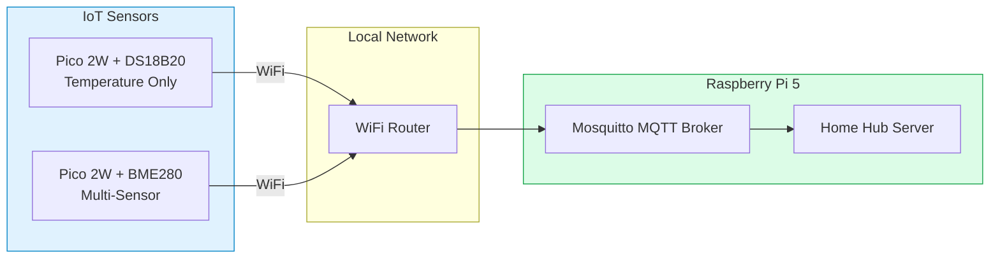
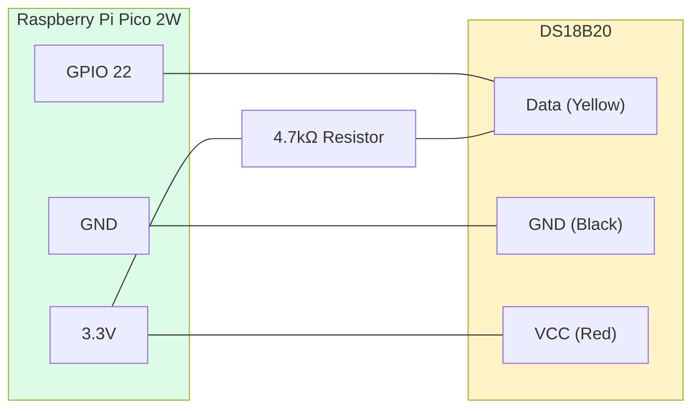
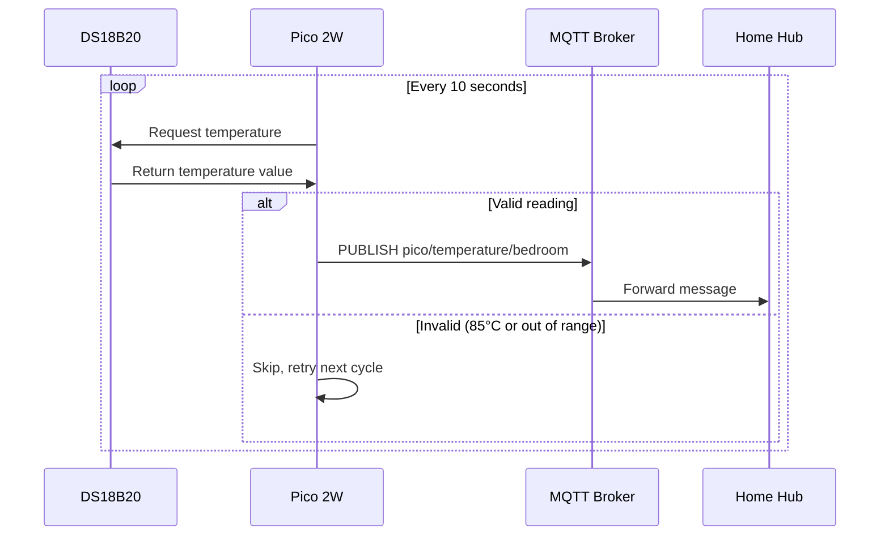
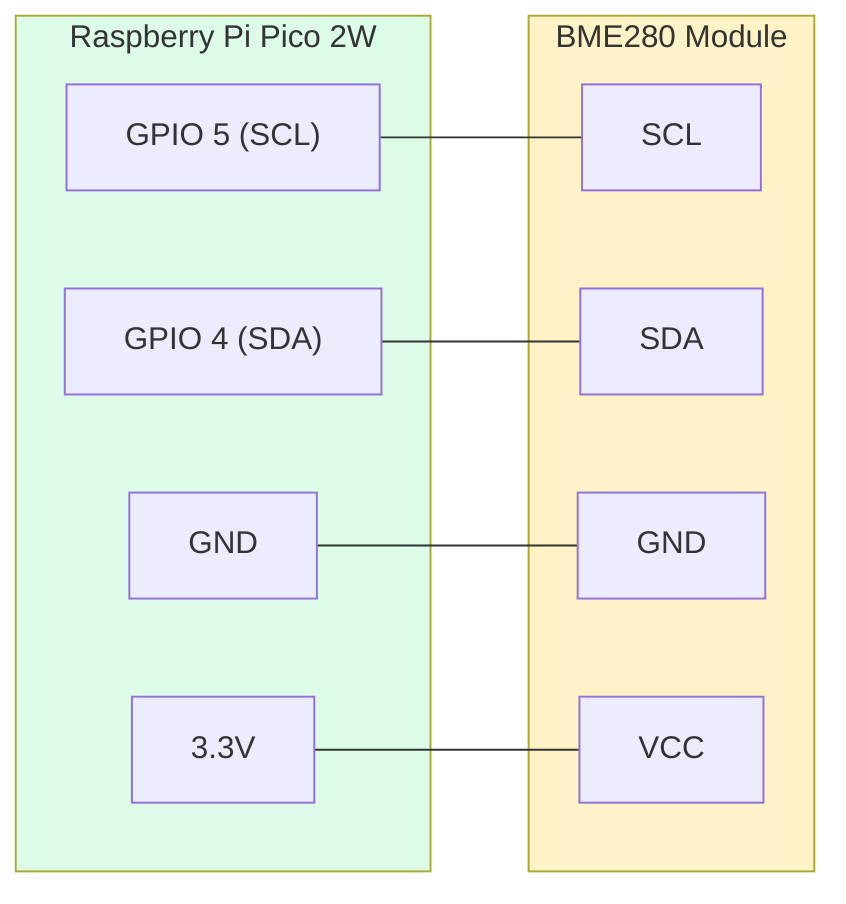
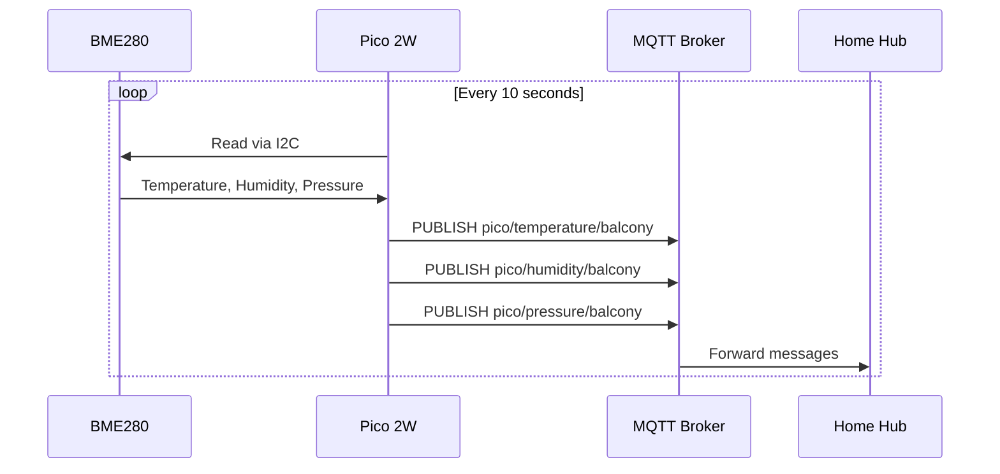
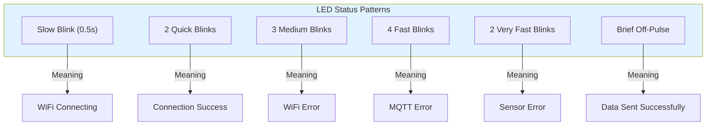
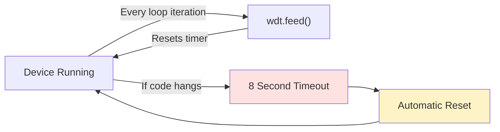

# IoT Sensors - Raspberry Pi Pico 2W Setup

> Hardware setup and MicroPython code for temperature and environmental sensors publishing data via MQTT.

---

## System Overview



---

## Sensor Comparison

| Feature | DS18B20 | BME280 |
|---------|---------|--------|
| **Interface** | 1-Wire | I2C |
| **Measurements** | Temperature | Temperature, Humidity, Pressure |
| **Accuracy** | ±0.5°C | ±1°C, ±3% RH, ±1 hPa |
| **Range** | -55°C to +125°C | -40°C to +85°C |
| **Power** | 3.0V - 5.5V | 1.8V - 3.6V |
| **Use Case** | Indoor rooms | Outdoor/environmental |

---

# DS18B20 Temperature Sensor Setup

## Hardware Components

- Raspberry Pi Pico 2WH
- DS18B20 temperature sensor (see [picture](ds18b20.webp))
  - One-wire digital temperature sensor
  - Unique 64-bit serial code per sensor
  - Power supply: 3.0V to 5.5V
  - Operating range: -55°C to +125°C
  - Accuracy: ±0.5°C (between -10°C to 85°C)
- 4.7kΩ pull-up resistor
- Breadboard and jumper wires

## Wiring Diagram



See [schematic diagram](raspberry-pi-pico-ds18b20-wiring_bb.webp) for detailed wiring.

## Software Requirements

- MicroPython firmware for Raspberry Pi Pico 2WH
- Thonny IDE for uploading code
- MQTT library (umqtt)

## MQTT Topic Structure

```
pico/temperature/{sensor_name}
```

Example: `pico/temperature/bedroom`

## Code Files Required

| File | Purpose |
|------|---------|
| [config.py](./raspberry-pi-pico-2w-micropython/config.md) | WiFi and MQTT credentials |
| [main.py](./raspberry-pi-pico-2w-micropython/main-temperature-ds18b20.md) | Main sensor loop |
| [umqtt/simple.py](./raspberry-pi-pico-2w-micropython/umqtt/simple.md) | MQTT client library |
| [umqtt/robust.py](./raspberry-pi-pico-2w-micropython/umqtt/robust.md) | Robust MQTT wrapper |

## Data Flow



---

# BME280 Multi-Sensor Setup

## Hardware Components

- Raspberry Pi Pico 2WH
- BME280 sensor module (see [picture](bme280.webp))
  - I2C digital environmental sensor
  - I2C address: 0x76 (default) or 0x77
  - Power supply: 1.8V to 3.6V
  - Temperature range: -40°C to +85°C
  - Humidity range: 0% to 100% RH
  - Pressure range: 300 to 1100 hPa
- Breadboard and jumper wires

## Wiring Diagram



See [schematic diagram](raspberry-Pi-Pico-BME280-circuit-diagram_bb.webp) for detailed wiring.

## MQTT Topic Structure

The BME280 publishes to three separate topics:

```
pico/temperature/{sensor_name}
pico/humidity/{sensor_name}
pico/pressure/{sensor_name}
```

Example topics for balcony sensor:
- `pico/temperature/balcony`
- `pico/humidity/balcony`
- `pico/pressure/balcony`

## Code Files Required

| File | Purpose |
|------|---------|
| [config.py](./raspberry-pi-pico-2w-micropython/config.md) | WiFi and MQTT credentials |
| [main.py](./raspberry-pi-pico-2w-micropython/main-multisensor-bme280.md) | Main sensor loop |
| [BME280.py](./raspberry-pi-pico-2w-micropython/BME280.md) | BME280 I2C driver |
| [umqtt/simple.py](./raspberry-pi-pico-2w-micropython/umqtt/simple.md) | MQTT client library |
| [umqtt/robust.py](./raspberry-pi-pico-2w-micropython/umqtt/robust.md) | Robust MQTT wrapper |

## Data Flow



---

## LED Status Patterns

Both sensors use the onboard LED for visual feedback:



| Pattern | Duration | Meaning |
|---------|----------|---------|
| Slow blink | 0.5s on/off | WiFi connecting |
| 2 quick blinks | 0.1s each | Connection successful |
| 3 medium blinks | 0.2s each | WiFi error |
| 4 fast blinks | 0.15s each | MQTT error |
| 2 very fast blinks | 0.1s each | Sensor read error |
| Brief off-pulse | 50ms | Data transmitted |

---

## Watchdog Timer

Both sensor implementations include a watchdog timer for automatic recovery:



The watchdog timer (`WDT`) ensures the device automatically restarts if:
- Code enters an infinite loop
- Network operation hangs
- Sensor communication fails

---

## File Structure on Pico

Upload files to the Pico using Thonny IDE:

```
/
├── main.py          # Main sensor code
├── config.py        # WiFi/MQTT credentials
├── BME280.py        # (BME280 only) I2C driver
└── umqtt/
    ├── simple.py    # MQTT client
    └── robust.py    # Robust wrapper
```

---

## Configuration Template

Edit `config.py` with your network settings:

```python
wifi_ssid = 'YourWiFiName'
wifi_password = 'YourWiFiPassword'
mqtt_server = b'192.168.0.50'  # Raspberry Pi 5 IP
mqtt_username = b'pico_bedroom'
mqtt_password = b'your_mqtt_password'
```

---

## Troubleshooting

| Issue | Possible Cause | Solution |
|-------|---------------|----------|
| No LED activity | No power | Check USB connection |
| Slow blinking forever | WiFi not connecting | Verify SSID/password |
| 4 fast blinks | MQTT connection failed | Check broker IP and credentials |
| Reading 85°C | DS18B20 power issue | Check wiring and pull-up resistor |
| No sensor found | I2C address wrong | Try 0x77 instead of 0x76 |

---

## References

- [Raspberry Pi Pico: DS18B20 Temperature Sensor (MicroPython)](https://randomnerdtutorials.com/raspberry-pi-pico-ds18b20-micropython/)
- [Raspberry Pi Pico W: Getting Started with MQTT (MicroPython)](https://randomnerdtutorials.com/raspberry-pi-pico-w-mqtt-micropython/)
- [Raspberry Pi Pico: BME280 Get Temperature, Humidity, and Pressure (MicroPython)](https://randomnerdtutorials.com/raspberry-pi-pico-bme280-micropython/)
